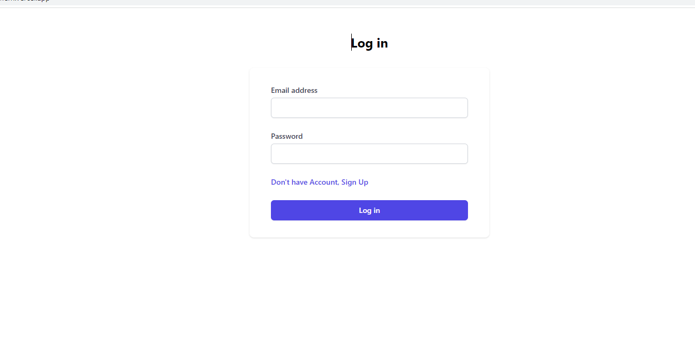

# [Todo App 📝](https://kaushalam-task-full-stack-front.vercel.app/)
## **Explanation Video :[Click Here](coming soon)**
---

## Task

- In this assignment I have to create full stack MERN application with authetication and after this it should get to the dashboard of my todo.

- Where Schema model will be having:

  - User Schema (Username,password,email)

  - Title Schema

    - Title (Title for all the task e.g Sunday)
    - Tasks ( eg. on Sunday I'll do shopping, family time, movies etc.)

- No of controllers will be there for the title,tasks and user

- First Intention to create title then after adding it to the list I'll add extra task under it.

## Technologies (Will be used in it)

---

- Node.js 
- Express.js(node.js Framework) 
- Postman
- Mongoose(will connect to MongoDB)
- MongoDB
- React.js
- Other required packages.

---

## Planning

### Frontend planning

---

### Backend planning

### After Implementation shots

---
### Submitted by : 

- Name : Dalsaniya Jemmy .V
- Roll : 21BCP319
- [PortFolio](https://jemmy.vercel.app/)
- [Linkedin](https://www.linkedin.com/in/jemmy-dalsaniya-29924b255/)

---
